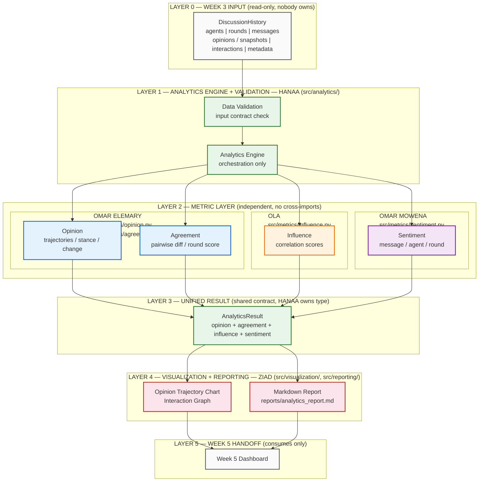
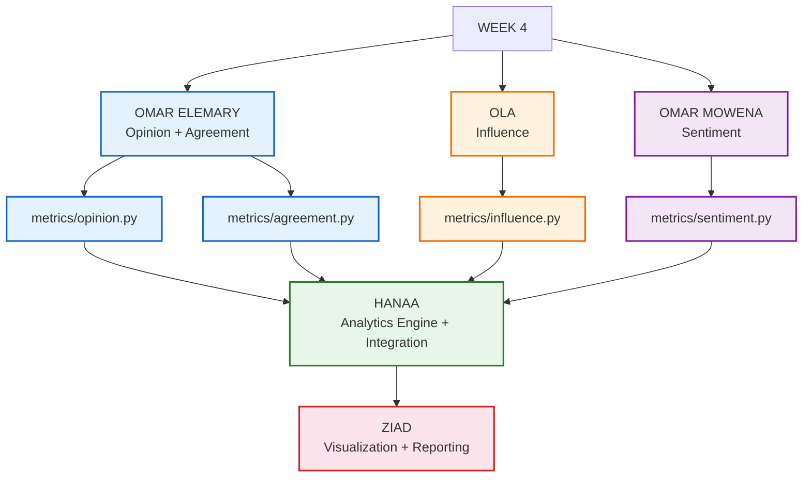
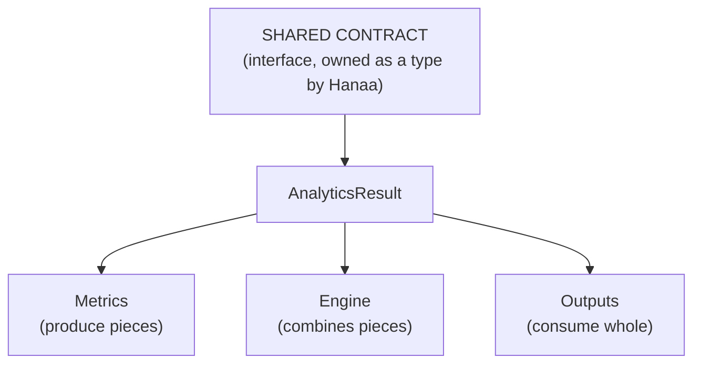
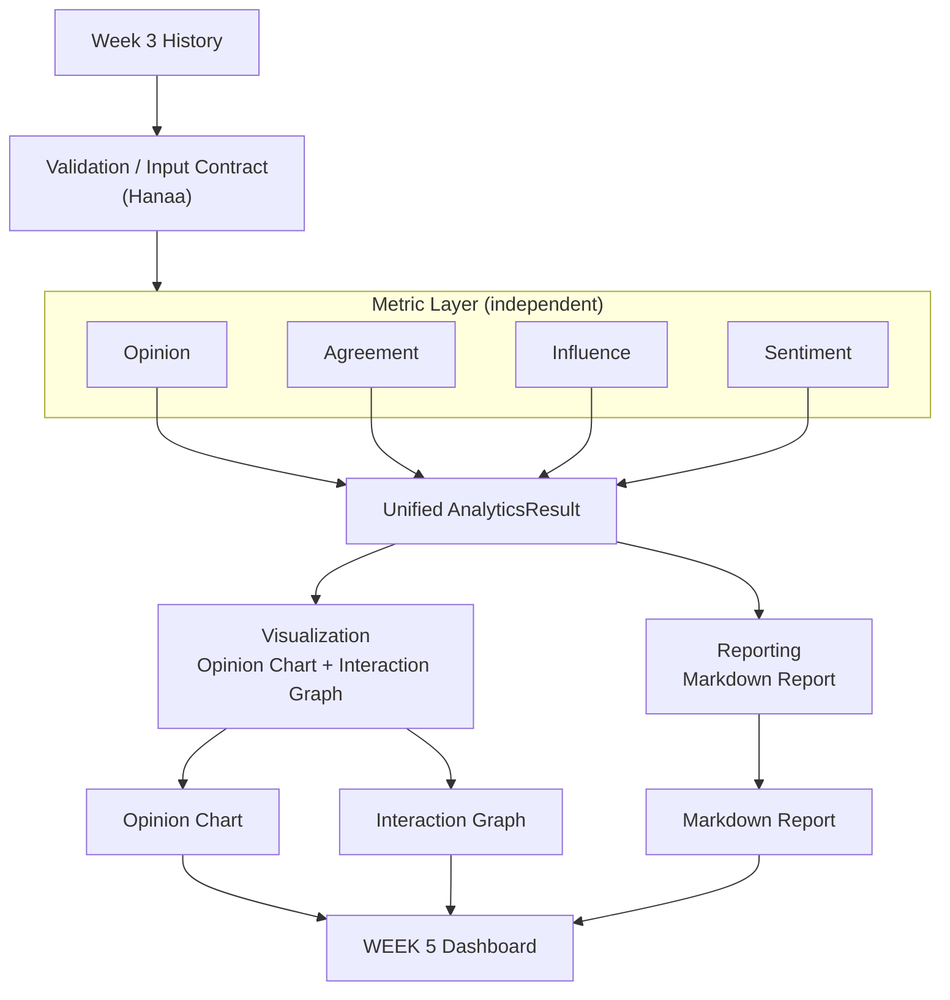
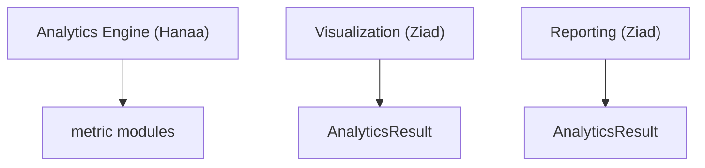

# Week 4 — Analytics & Intelligence Layer Architecture

> **Goal:** consume Week 3 structured discussion history and produce
> Opinion + Agreement + Influence + Sentiment analytics through one unified
> engine, then visualize + report — with **zero overlapping file ownership**
> so 5 people can work in parallel without merge conflicts.
>
> **Non-goals:** do not redesign Week 3. No new microservices, databases,
> APIs, or agents. Repository-oriented, modular, implementation-ready.

---

## 1. Repository Map (target end-state)

```text
src/
├── metrics/                  # Metric layer (3 owners, 4 files — never shared)
│   ├── __init__.py           # (Hanaa — re-export only, no logic)
│   ├── opinion.py            # OMAR ELEMARY ONLY
│   ├── agreement.py          # OMAR ELEMARY ONLY
│   ├── influence.py          # OLA ONLY
│   └── sentiment.py          # OMAR MOWENA ONLY
├── analytics/                # Unified engine + contracts + validation
│   ├── __init__.py           # HANAA ONLY
│   ├── contracts.py          # HANAA ONLY (dataclasses / TypedDicts)
│   ├── validation.py         # HANAA ONLY (input contract check)
│   └── engine.py             # HANAA ONLY (orchestration)
├── visualization/            # ZIAD ONLY
│   ├── __init__.py
│   ├── opinion_chart.py      # X=round, Y=stance, line=agent
│   └── interaction_graph.py  # node=agent, edge=relationship, weight=influence|volume
├── reporting/                # ZIAD ONLY
│   ├── __init__.py
│   └── markdown.py           # writes reports/analytics_report.md
tests/
├── test_opinion.py           # OMAR ELEMARY ONLY
├── test_agreement.py         # OMAR ELEMARY ONLY
├── test_influence.py         # OLA ONLY
├── test_sentiment.py         # OMAR MOWENA ONLY
├── test_visualization.py     # ZIAD ONLY
├── test_reporting.py         # ZIAD ONLY
└── test_analytics_engine.py  # HANAA ONLY
reports/
└── analytics_report.md       # generated artifact (ZIAD, via engine output)
```

> `src/metrics/__init__.py` re-exports only (owned by Hanaa, updated once
> via PR). Nobody puts calculation logic in `__init__.py`.

---

## 2. Layered Architecture (normative diagram)

### 2a. Mermaid — layers + ownership boundaries



### 2b. ASCII — canonical layer view (ownership-labeled)

```text
┌───────────────────────────────────────────────────────────┐
│                     WEEK 3 DATA                           │
│              (read-only input, nobody owns)               │
│ Discussion History                                        │
│ Agents | Rounds | Messages | Opinions | Interactions    │
└───────────────────────────┬───────────────────────────────┘
                            │
                            ▼
┌───────────────────────────────────────────────────────────┐
│              ANALYTICS ENGINE + VALIDATION                │
│                       Hanaa                               │
│              src/analytics/                               │
│ Input Contract │ Validation │ Orchestration               │
│ Unified AnalyticsResult (type owner)                      │
└─────────────┬─────────────┬──────────────┬────────────────┘
              │             │              │
              ▼             ▼              ▼
       ┌────────────┐ ┌────────────┐ ┌────────────┐
       │  OPINION   │ │ AGREEMENT  │ │ INFLUENCE  │
       │   OMAR     │ │    OMAR    │ │    OLA     │
       │ ELEMARY    │ │  ELEMARY   │ │            │
       └────────────┘ └────────────┘ └────────────┘
              │             │              │
              └─────────────┴──────────────┤
                                           ▼
                                  ┌────────────────┐
                                  │   SENTIMENT    │
                                  │  OMAR MOWENA   │
                                  └────────────────┘
                            │
                            ▼
┌───────────────────────────────────────────────────────────┐
│                UNIFIED ANALYTICS RESULT                   │
│                  (Hanaa owns the type)                    │
│ opinion + agreement + influence + sentiment               │
└───────────────────────────┬───────────────────────────────┘
                            │
                            ▼
┌───────────────────────────────────────────────────────────┐
│             VISUALIZATION + REPORTING                     │
│                         ZIAD                              │
│ src/visualization/ │ src/reporting/                       │
│ Opinion Trajectory │ Interaction Graph │ Markdown Report │
└───────────────────────────┬───────────────────────────────┘
                            │
                            ▼
                   WEEK 5 Dashboard
              (consumes charts + report only)
```

**How to read ownership:** each bordered box = one person's exclusive
write-access. Arrows = data flow only, never write-access.

---

## 3. Team Ownership (exact file boundaries)

### 3.1 Omar Elemary — Opinion + Agreement Analytics

**Owns ONLY:**

```text
src/metrics/opinion.py
src/metrics/agreement.py

tests/test_opinion.py
tests/test_agreement.py
```

**Responsibilities:**

* opinion trajectories
* per-agent per-round stance
* stance changes
* direction and magnitude of opinion movement
* agreement/disagreement scores
* pairwise stance differences
* round-level agreement aggregation
* handling missing/invalid opinion data

**Inputs:**

```text
Week 3 Discussion History
        ↓
Opinion Snapshots / Stances
```

**Outputs:**

```text
OpinionAnalytics
AgreementAnalytics
```

**Example shapes (already implemented — do not change without Omar):**

```text
OpinionAnalytics  (OpinionChangeResult)
 ├── agent_id
 ├── rounds
 ├── stance            # float in [-1.0, +1.0] | None
 └── change            # float | None (consecutive valid rounds only)

AgreementAnalytics (list[AgreementRound])
 ├── round
 ├── agreement_score           # 1 - mean_diff/2, [0,1] | None
 ├── mean_pairwise_difference  # float | None
 └── number_of_agents          # n_agents / n_valid / n_invalid + status
```

**MUST NOT own:** influence, sentiment, visualization, Markdown reporting,
unified orchestration, validation framework, Week 5 dashboard.

---

### 3.2 Ola — Influence Analytics

**Owns ONLY:**

```text
src/metrics/influence.py
tests/test_influence.py
```

**Responsibilities:**

* correlation-based influence
* relationship between agents
* stance-change correlation
* interaction/message relationships
* influence scores
* insufficient-data handling
* explicitly avoid claiming causation

**Inputs:**

```text
Discussion History
Opinion Changes      (read via engine-passed stances — do NOT import opinion.py internals)
Interactions / Messages
```

**Outputs:**

```text
InfluenceAnalytics
```

**Suggested contract (Ola defines internals, keeps this shape):**

```python
@dataclass
class InfluenceEdge:
    source_agent: str
    target_agent: str
    influence_score: float | None   # correlation, NOT causation
    n_common_rounds: int
    status: str                    # "ok" | "insufficient_data"

@dataclass
class InfluenceAnalytics:
    edges: list[InfluenceEdge]
    method_note: str = "correlation only; not causal"
```

> Do NOT place influence implementation inside Omar's module.

---

### 3.3 Omar Mowena — Sentiment Analytics

**Owns ONLY:**

```text
src/metrics/sentiment.py
tests/test_sentiment.py
```

**Responsibilities:**

* per-message sentiment
* sentiment score
* sentiment labels
* agent-level summaries
* round-level summaries

**Inputs:**

```text
Messages   (Week 3 messages only)
```

**Outputs:**

```text
SentimentAnalytics
```

**Suggested contract:**

```python
@dataclass
class MessageSentiment:
    message_id: str
    agent_id: str
    round: int
    score: float        # e.g. [-1.0, +1.0]
    label: str          # "positive" | "neutral" | "negative"

@dataclass
class SentimentAnalytics:
    messages: list[MessageSentiment]
    by_agent: dict[str, dict]   # agent_id -> {mean_score, counts}
    by_round: dict[int, dict]   # round -> {mean_score, counts}
```

> Do NOT place sentiment logic inside Opinion or Agreement modules.

---

### 3.4 Ziad — Visualization + Reporting

**Owns ONLY:**

```text
src/visualization/
src/reporting/

tests/test_visualization.py
tests/test_reporting.py
```

**Responsibilities — Visualization:**

```text
Opinion trajectory chart
Interaction graph
```

Opinion chart:

```text
X = round
Y = stance
Line = agent
```

Interaction graph:

```text
Node = agent
Edge = communication relationship
Edge weight = influence or message volume
```

**Responsibilities — Reporting — generate:**

```text
reports/analytics_report.md
```

Report MUST contain:

* opinion analysis
* agreement analysis
* influence analysis
* sentiment analysis
* interpretation
* limitations

**Hard rule:** visualization/reporting consume `AnalyticsResult` —
they **reimplement zero analytics calculations**.

```python
# Ziad's allowed pattern
def plot_opinion_trajectories(result: AnalyticsResult, out_path: str) -> str: ...
def plot_interaction_graph(result: AnalyticsResult, out_path: str) -> str: ...
def build_markdown_report(result: AnalyticsResult) -> str: ...  # -> reports/analytics_report.md
```

---

### 3.5 Hanaa — Analytics Engine + Integration

**Owns ONLY:**

```text
src/analytics/
tests/test_analytics_engine.py
```

**Responsibilities:**

* unified Analytics Engine
* analytics contracts
* orchestration
* validation
* integration
* combining outputs from all metric modules
* handling malformed/incomplete Week 3 history
* producing one unified analytics result

**Main flow (the engine CALLS metrics; it never duplicates them):**

```text
DiscussionHistory
        ↓
Data Validation
        ↓
Analytics Engine
        ↓
 ┌───────────────┬────────────────┬────────────────┐
 ↓               ↓                ↓                ↓
Opinion       Agreement       Influence       Sentiment
 ↓               ↓                ↓                ↓
 └───────────────┴────────────────┴────────────────┘
                         ↓
                  AnalyticsResult
                         ↓
              Visualization + Report
```

**Engine skeleton (Hanaa implements):**

```python
# src/analytics/contracts.py
@dataclass
class AnalyticsResult:
    opinion: OpinionChangeResult
    agreement: list[AgreementRound]
    influence: InfluenceAnalytics
    sentiment: SentimentAnalytics
    warnings: list[str]

# src/analytics/validation.py
def validate_history(history) -> list[str]: ...  # returns warnings, raises on fatal

# src/analytics/engine.py
def run_analytics(history) -> AnalyticsResult:
    from src.metrics.opinion import calculate_opinion_change
    from src.metrics.agreement import calculate_agreement
    from src.metrics.influence import calculate_influence
    from src.metrics.sentiment import analyze_sentiment
    ...
```

---

## 4. Parallel Development Ownership — Merge Conflict Safe



```text
                    WEEK 4
                      │
        ┌─────────────┼─────────────┐
        │             │             │
        ▼             ▼             ▼

     OMAR          OLA          OMAR MOWENA
   Opinion +     Influence       Sentiment
   Agreement
        │             │             │
        ▼             ▼             ▼
 metrics/opinion  metrics/      metrics/
 .py              influence.py  sentiment.py
 metrics/
 agreement.py

        │             │             │
        └─────────────┼─────────────┘
                      │
                      ▼
                    HANAA
             Analytics Engine
                Integration
             (src/analytics/)

                      │
                      ▼
                    ZIAD
             Visualization
               Reporting
        (src/visualization/,
         src/reporting/)
```

**Why this is conflict-safe:** no two boxes share a file. The only shared
touchpoint is the `AnalyticsResult` *interface shape* (Section 5), agreed
once, then each person codes against it independently.

---

## 5. File Ownership Table (normative — do not violate)

| Owner        | Responsibility            | Main Files                                   |
| ------------ | ------------------------- | -------------------------------------------- |
| Omar Elemary | Opinion + Agreement       | `metrics/opinion.py`, `metrics/agreement.py` |
| Ola          | Influence                 | `metrics/influence.py`                       |
| Omar Mowena  | Sentiment                 | `metrics/sentiment.py`                       |
| Ziad         | Visualization + Reporting | `visualization/`, `reporting/`               |
| Hanaa        | Engine + Integration      | `analytics/`                                 |

Full test-file mapping:

| Owner        | Test files                                          |
| ------------ | --------------------------------------------------- |
| Omar Elemary | `tests/test_opinion.py`, `tests/test_agreement.py`  |
| Ola          | `tests/test_influence.py`                           |
| Omar Mowena  | `tests/test_sentiment.py`                           |
| Ziad         | `tests/test_visualization.py`, `tests/test_reporting.py` |
| Hanaa        | `tests/test_analytics_engine.py`                    |

---

## 6. Shared Contract Rule



```text
                    SHARED CONTRACT
                          │
                          ▼
                 AnalyticsResult
                          │
        ┌─────────────────┼─────────────────┐
        │                 │                 │
     Metrics          Engine            Outputs
   (produce it)    (combine into it)  (consume it)
```

> The shared contract is the **interface**, not a shared implementation
> file that everyone edits.

* Each metric returns a predictable result the engine can consume
  (shapes in §3.1–§3.3).
* Hanaa owns `src/analytics/contracts.py` (the `AnalyticsResult` type).
* Metric owners **do not edit** `contracts.py`; if a shape must change,
  they request it via PR review comment and Hanaa applies it.
* Output owners (Ziad) **do not edit** metric files to "fix" a shape;
  they handle `None` / `insufficient_data` defensively.

**Write-access checklist:**

```text
OMAR ELEMARY
✓ metrics/opinion.py
✓ metrics/agreement.py
✓ tests/test_opinion.py, tests/test_agreement.py

OLA
✓ metrics/influence.py
✓ tests/test_influence.py

OMAR MOWENA
✓ metrics/sentiment.py
✓ tests/test_sentiment.py

ZIAD
✓ visualization/*
✓ reporting/*
✓ tests/test_visualization.py, tests/test_reporting.py

HANAA
✓ analytics/*  (contracts.py, validation.py, engine.py)
✓ tests/test_analytics_engine.py
✓ metrics/__init__.py re-exports ONLY
```

> **Rule:** never modify another owner's implementation files.
> Need something from another module? Read its output type, or ask the
> owner — do not reach into their internals. This avoids every
> multi-editor-same-file merge conflict by construction.

---

## 7. Data Flow (exact conceptual flow)



```text
Week 3 History
      │
      ▼
Validation / Input Contract        ← Hanaa (src/analytics/validation.py)
      │
      ▼
┌───────────────────────────────────────┐
│           Metric Layer                │
│        (no cross-imports between      │
│         metric implementations)       │
│ Opinion ────────┐                    │ ← Omar Elemary
│ Agreement ──────┤                    │ ← Omar Elemary
│ Influence ──────┤                    │ ← Ola
│ Sentiment ──────┘                    │ ← Omar Mowena
└──────────────────┬────────────────────┘
                   │
                   ▼
          Unified AnalyticsResult       ← Hanaa (src/analytics/contracts.py)
                   │
          ┌────────┴────────┐
          ▼                 ▼
    Visualization        Reporting      ← Ziad (both sides)
          │                 │
          ▼                 ▼
 Opinion Chart       Markdown Report
 Interaction Graph   reports/analytics_report.md
          │
          ▼
       WEEK 5
       Dashboard                ← consumes charts + report only
```

---

## 8. Dependency Rules

### 8a. Allowed (Mermaid)



```text
Allowed:

Analytics Engine (Hanaa)
        ↓ calls
metric modules (opinion / agreement / influence / sentiment)

Visualization (Ziad)
        ↓ reads
AnalyticsResult (whole object, read-only)

Reporting (Ziad)
        ↓ reads
AnalyticsResult (whole object, read-only)
```

### 8b. Avoid (hard bans)

```text
Avoid — these imports/couplings are FORBIDDEN:

Opinion → Influence implementation        (no metric-to-metric imports)
Opinion → Sentiment implementation
Visualization → Opinion calculation       (charts must NOT recompute stance)
Reporting → Agreement calculation         (report must NOT recompute agreement)
Metric A → Metric B internal implementation (metrics stay independent)
Anybody → Week 5 dashboard internals      (Week 5 pulls; Week 4 never pushes internals)
Engine → chart/report internals           (engine stops at AnalyticsResult)
```

**Enforcement:**

* `src/metrics/opinion.py`, `agreement.py`, `influence.py`, `sentiment.py`
  must not import each other. (Only `agreement.py → opinion.extract_stance`
  reuse is grandfathered in because both files share one owner — Omar —
  and the stance extractor is the single source of truth.)
* `src/visualization/*` and `src/reporting/*` import only
  `src.analytics.contracts` types + stdlib/plotting libs.
* `src/analytics/engine.py` is the **only** module allowed to import all
  four metric modules.
* Code review rejects any PR that adds a banned import.

---

## 9. Git / Branch Ownership

Recommended branches (one per owner, cut from `main` / `week4-final` base):

```text
week4-opinion-agreement-omar
week4-influence-ola
week4-sentiment-omar-mowena
week4-visualization-reporting-ziad
week4-engine-integration-hanaa
```

Working rule:

```text
Each member works primarily inside their own owned directories.
```

Integration path:

```text
shared contracts (agree AnalyticsResult shape first)
        ↓
feature branches (one per owner above)
        ↓
pull requests (owner requests review; NOBODY pushes to another owner's branch)
        ↓
Hanaa integration branch (week4-engine-integration-hanaa resolves wiring)
        ↓
Week 4 final (tagged merge after test_analytics_engine.py passes end-to-end)
```

Conflict-avoidance checklist per PR:

1. `git status` shows only files in your ownership table (§5). If not — stop.
2. New metric output shape? Open a PR comment tagging Hanaa instead of
   editing `src/analytics/contracts.py` yourself.
3. Need test fixture history? Copy `data/discussions/*.json` shape into
   your own test — never edit Week 3 fixtures in place.
4. Ziad needs sample outputs before Hanaa lands? Build against a stub
   `AnalyticsResult` dict in `tests/test_visualization.py` — do not stub
   inside `src/analytics/`.

---

## 10. Coverage Checklist (the 10 required visual elements)

| #  | Element              | Where in this doc                    |
|----|----------------------|--------------------------------------|
| 1  | Week 3 input         | §2 (Layer 0), §7                     |
| 2  | Validation           | §2 (Layer 1), §3.5, §7               |
| 3  | Metric layer         | §2 (Layer 2), §7                     |
| 4  | Each person's ownership | §3, §4, §5                        |
| 5  | Shared contracts     | §6                                    |
| 6  | Analytics Engine     | §2 (Layer 1), §3.5, §8a              |
| 7  | Unified AnalyticsResult | §2 (Layer 3), §6, §7              |
| 8  | Visualization        | §2 (Layer 4), §3.4, §7               |
| 9  | Reporting            | §2 (Layer 4), §3.4, §7               |
| 10 | Week 5 handoff       | §2 (Layer 5), §7                     |

**Core property (must hold):**

> Every team member can implement their assigned module independently
> and merge with minimal conflicts — because ownership boundaries are
> file-exclusive, data flows one way (history → metrics → result →
> outputs), and the only shared surface is a read-only result interface.

---

## 11. Parallel Work Plan (suggested order)

1. **Hanaa first (30 min):** land `contracts.py` + `validation.py` stubs so
   everyone has types to code against.
2. **Omar / Ola / Omar Mowena in parallel:** implement metric functions
   against Week 3 `DiscussionState` / `to_dict()` fixtures; green unit tests.
3. **Hanaa:** wire `engine.py` once at least two metrics are green.
4. **Ziad in parallel from step 2:** build charts/report against a stub
   `AnalyticsResult`; swap in the real engine output at integration time.
5. **Joint:** PRs → Hanaa branch → `reports/analytics_report.md` smoke test
   → Week 4 final.
